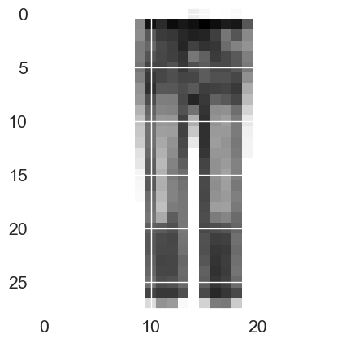

# Computer-Vision-Deep-Learning 👁️🤖

Este repositorio contiene una serie de proyectos desarrollados durante el **Máster en Ingeniería Informática (Universidad de Huelva)**, enfocados en la resolución de problemas de visión por computador mediante arquitecturas avanzadas de **Deep Learning**.

Se exploran desde redes neuronales densas hasta el uso de **Transfer Learning** con modelos pre-entrenados de última generación.

---

## Contenido del repositorio 📁

### 1. Clasificación de imágenes (Fashion-MNIST) - Redes densas
Comparativa de diferentes configuraciones de redes neuronales densamente conectadas (MLP).
* **Hito:** Evaluación del impacto del número de capas y neuronas en la convergencia del modelo.

### 2. Redes Neuronales Convolucionales (CNN) desde cero
Implementación de arquitecturas CNN personalizadas para mejorar la extracción de características espaciales.
* **Resultado:** Se logró romper la barrera del 90% de accuracy, superando ampliamente a las redes densas.
* **Modelos:** CNN Simple vs. CNN Profunda con múltiples bloques convolucionales.

### 3. Transfer Learning y Data Augmentation (reconocimiento facial)
Uso de modelos pre-entrenados para la clasificación de expresiones faciales (dataset FER-2013).
* **Técnicas:** Fine-tuning y Extracción de Características utilizando **VGGFace**.
* **Optimización:** Implementación de `ImageDataGenerator` para aumentar la robustez del modelo frente a ruido y falta de datos.

---

## Comparativa de rendimiento 📊

| Modelo | Arquitectura | Accuracy (Test) | Nota Técnica |
| :--- | :--- | :--- | :--- |
| Red densa (MLP) | 512-256-128 | 89.34% | Límite de redes densas |
| **CNN profunda** | **3 bloques conv + 256N** | **92.87%** | **Mejor rendimiento propio** |
| Transfer Learning| VGGFace (Fine-tuning)| 62.26% | Éxito en dataset ruidoso (FER) |

> **Nota visual:** La arquitectura CNN profunda logró superar la barrera del 90% de precisión, demostrando la superioridad de las capas convolucionales para capturar jerarquías espaciales.

---

## Datasets 📊

* **Práctica 1 y 2**: Se utiliza el dataset **Fashion-MNIST**, cargado directamente mediante `tensorflow.keras.datasets`.

  
  
<i>Ejemplos de las 10 categorías de prendas de vestir clasificadas</i>

  
* **Práctica 3**: Se utiliza el dataset **FER-2013**. Debido a su tamaño, no se incluye en este repositorio. Puedes descargarlo en:
  * [Kaggle - FER2013 Dataset](https://www.kaggle.com/datasets/msambare/fer2013)

---

## Tecnologías y librerías 🛠️

* **Python 3** | **TensorFlow / Keras** | **OpenCV** * **Scikit-learn:** Métricas de evaluación (F1-Score, Confusion Matrix).
* **Matplotlib / Seaborn:** Visualización de resultados.

---

## Estructura de archivos 📂

Puedes explorar cada proyecto individualmente a través de los siguientes enlaces, que contienen el **notebook (.ipynb)** y la **memoria técnica (PDF)**:

* 📁 **[01-Fashion-MNIST-MLP](./01-Fashion-MNIST-MLP)**: Redes densas y optimización.
* 📁 **[02-CNN-Deep-Learning](./02-CNN-Deep-Learning)**: Arquitecturas convolucionales personalizadas.
* 📁 **[03-Transfer-Learning-VGGFace](./03-Transfer-Learning-VGGFace)**: Reconocimiento facial avanzado.

---
*Proyectos realizados en la asignatura de Computación Inteligente - Máster en Ingeniería Informática (UHU).*
